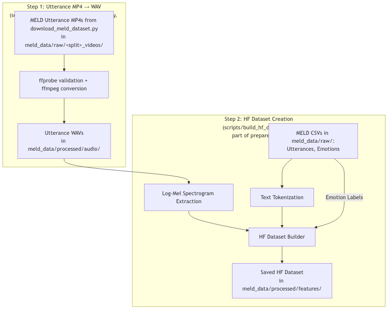
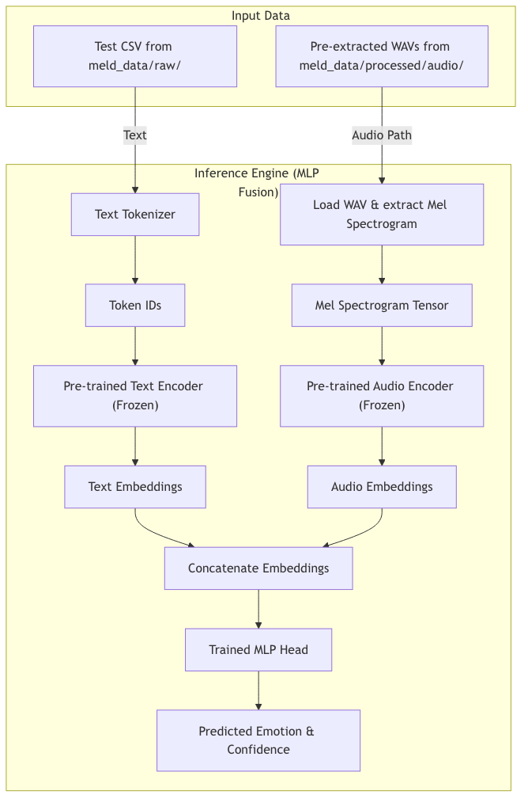
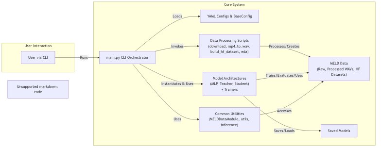
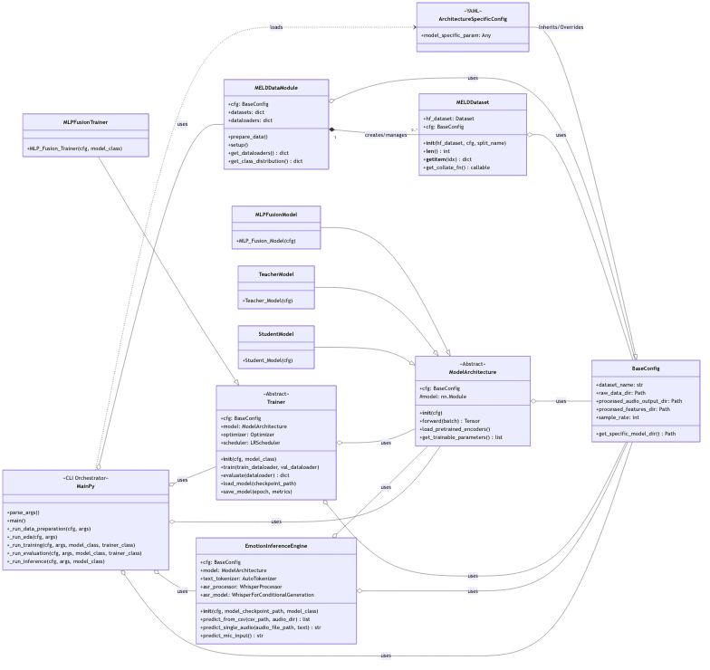
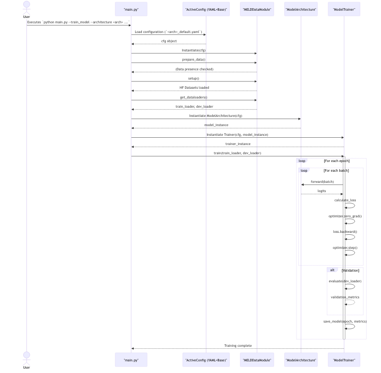
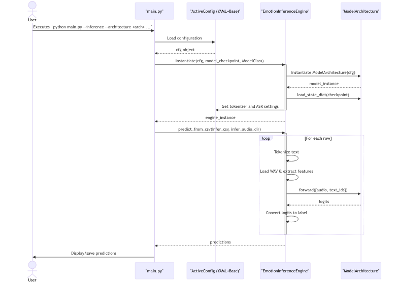

# Emotion Classification from Audio + Text (DLFA Capstone Project)

This repository contains the code and resources for the Capstone Project: "Emotion Classification from Audio + Text Using Lightweight Dual-Encoder Models". The project has been refactored for modularity, extensibility, and to support multiple model architectures.

## Project Goal

Given a spoken utterance and its transcript from the MELD dataset, predict the speaker's categorical emotion (e.g., anger, joy, neutral) with a primary goal of **≥ 75% weighted-F1 on MELD** while keeping **end-to-end inference below 200 ms** per 5-second chunk on a single GPU for the most efficient model.

## Key Features

*   **Multiple Model Architectures**: Support for three distinct model architectures (MLP Fusion, Teacher, Student).
*   **Modular Design**: Code organized into `common/` (shared utilities), `architectures/` (model-specific code), `configs/` (configuration files), and `scripts/` (data processing).
*   **Centralized Configuration**: A base configuration class in `configs/base_config.py` and architecture-specific settings managed via YAML files (e.g., `configs/mlp_fusion_default.yaml`), loaded by `main.py`.
*   **Comprehensive Data Pipeline (Orchestrated by `main.py --prepare_data`)**:
    *   Dataset download and extraction (`scripts/download_meld_dataset.py`).
    *   Robust utterance-level MP4 to WAV conversion using `scripts/extract_meld_wavs_from_mp4s.py` (with `ffprobe` validation), controlled by a flag in the YAML configuration.
    *   Comprehensive Hugging Face dataset creation from WAVs and CSVs using `scripts/build_hf_dataset.py` (including feature extraction and optional ASR).
*   **Exploratory Data Analysis (EDA) (Orchestrated by `main.py --run_eda`)**: Scripts for analyzing both raw (`scripts/preliminary_eda.py`) and processed MELD data (`scripts/processed_features_eda.py`).
*   **CLI Interface**: A main entry point `main.py` for data preparation, EDA, training, evaluation, and inference, allowing easy selection of model architectures and configurations.
*   **Automated Pipeline Script**: `run_meld_pipeline_sagemaker.sh` for end-to-end data processing, suitable for environments like AWS SageMaker.
*   **Colab Compatibility**: A `colab_runner.ipynb` notebook for running experiments in Google Colab.

## Model Architectures

This project implements and supports three different model architectures:

1.  **MLP Fusion (Base Model)**:
    *   **Concept**: Simple concatenation of embeddings from pre-trained audio (e.g., WavLM) and text (e.g., Whisper, DistilRoBERTa) encoders, followed by an MLP classification head.
    *   **Characteristics**: Encoders are typically frozen. Lightweight, fast to train, and suitable for baseline performance or resource-constrained environments.
    *   **Implementation**: `architectures/mlp_fusion/`

2.  **Teacher TODKAT-lite (High Performance)**:
    *   **Concept**: A more powerful model, potentially based on architectures like RoBERTa-Large, incorporating topic modeling, COMET commonsense knowledge, and a more sophisticated fusion mechanism (e.g., 2-layer encoder-decoder).
    *   **Characteristics**: Aims for high performance (e.g., ≥ 70% W-F1). Requires more computational resources (e.g., A100 GPU).
    *   **Implementation**: `architectures/teacher/`

3.  **Student Distilled (Efficient)**:
    *   **Concept**: A compact model (e.g., DistilRoBERTa for text, WavLM-Base for audio) distilled from the Teacher model. May include additional components like a GRU party-tracker and multi-task learning (MTL) heads.
    *   **Characteristics**: Optimized for latency and efficiency, targeting strong performance (e.g., 65% W-F1) with low inference times (e.g., < 200ms) on consumer-grade GPUs.
    *   **Implementation**: `architectures/student/`

## Directory Structure

The project is organized into a modular structure:

```
emotion-classification-dlfa/
├── architectures/              # Model architecture implementations
│   ├── mlp_fusion/             # MLP Fusion model, trainer, config
│   ├── teacher/                # Teacher TODKAT-lite model, trainer, config, utils
│   └── student/                # Student Distilled model, trainer, config, utils
├── common/                     # Shared utilities and components
│   ├── data_loader.py          # MELD Dataset loading functionality (MELDDataModule)
│   └── utils.py                # Common utility functions (e.g., ensure_dir)
├── configs/                    # Configuration files
│   ├── base_config.py          # Base configuration class
│   ├── mlp_fusion_default.yaml # Default YAML config for MLP Fusion
│   ├── teacher_default.yaml    # Default YAML config for Teacher model
│   └── student_default.yaml    # Default YAML config for Student model
├── meld_data/                  # Data directory (not checked into git)
│   ├── raw/                    # Raw MELD dataset (CSVs, original videos/tarballs)
│   │   └── MELD.Raw/           # Example specific MELD raw data (if archive extracted here)
│   │       ├── train_sent_emo.csv
│   │       ├── dev_sent_emo.csv
│   │       ├── test_sent_emo.csv
│   │       ├── train_videos/   # Utterance MP4s (extracted by download_meld_dataset.py)
│   │       ├── dev_videos/     # Utterance MP4s (extracted by download_meld_dataset.py)
│   │       └── test_videos/    # Utterance MP4s (extracted by download_meld_dataset.py)
│   └── processed/              # Processed data
│       ├── audio/              # Extracted utterance-level WAV files
│       │   └── <split>/        # e.g., train/dia0_utt0.wav
│       └── features/           # Hugging Face datasets and/or other extracted features
│           ├── hf_datasets/    # Specifically for Hugging Face datasets
│           │   └── <split>/    # e.g., train/, dev/, test/ (containing HF dataset files)
│           └── (other_feature_types)/ # Potentially for .npz files from older scripts
├── models/                     # Saved model checkpoints (not checked into git)
│   ├── mlp_fusion/
│   ├── teacher/
│   └── student/
├── results/                    # Evaluation results and EDA outputs
│   ├── eda/
│   │   ├── preliminary_analysis/
│   │   └── processed_features_analysis/
│   ├── mlp_fusion/
│   ├── teacher/
│   └── student/
├── scripts/                    # Data processing and utility scripts
│   ├── download_meld_dataset.py # Script to download and extract MELD raw data (CSVs, video tarballs to utterance MP4s).
│   ├── extract_meld_wavs_from_mp4s.py # Robust utility for converting utterance-level MP4s to WAVs.
│   ├── build_hf_dataset.py     # Main script for building Hugging Face datasets from pre-existing utterance WAVs and CSVs.
│   ├── extract_features_meld.py # Older script for .npz feature extraction (potentially legacy)
│   ├── preliminary_eda.py      # EDA on raw MELD data
│   ├── processed_features_eda.py # EDA on processed Hugging Face datasets
│   └── script_helpers.py       # Helper functions for scripts
├── colab_runner.ipynb          # Google Colab execution notebook
├── main.py                     # Main CLI entry point for training, eval, inference
├── environment.yml             # Conda environment specification
├── run_meld_pipeline_sagemaker.sh # Automated script for full data pipeline (download, prep, EDA)
└── README.md                   # This file
```

## Environment Setup

A Conda environment is recommended.

1.  **Create the Environment**:
    If you have the `environment.yml` file:
    ```bash
    conda env create -f environment.yml
    ```
    Alternatively, to create manually with key packages:
    ```bash
    conda create --name emotion-classification-dlfa python=3.10 pip
    conda activate emotion-classification-dlfa
    conda install pandas numpy matplotlib seaborn scikit-learn pytorch torchvision torchaudio pytorch-cuda=11.8 -c pytorch -c nvidia # Adjust cuda version if needed
    pip install transformers datasets tqdm wandb ipykernel pyyaml librosa # Add other pip packages as necessary
    ```

2.  **Activate the Environment**:
    ```bash
    conda activate emotion-classification-dlfa
    ```

3.  **Install FFmpeg**:
    FFmpeg is required by `scripts/extract_meld_wavs_from_mp4s.py` for converting MP4s to WAV files. It is included in `environment.yml`. If installing manually:
    ```bash
    # On macOS with Homebrew
    brew install ffmpeg
    # On Linux with apt
    sudo apt update && sudo apt install ffmpeg
    # Or with Conda
    conda install ffmpeg -c conda-forge
    ```

## Data Pipeline: From Raw MELD to Model-Ready Features

The data pipeline involves downloading, preprocessing, feature engineering, and analysis. These steps can be run individually or orchestrated via `main.py` and the `run_meld_pipeline_sagemaker.sh` script.

### 1. Download MELD Dataset

*   **Script**: `scripts/download_meld_dataset.py`
*   **Function**: This script downloads `MELD.Raw.tar.gz` (containing CSVs and video tarballs like `train.tar.gz`), extracts the main archive, and then extracts the video tarballs into utterance-level MP4s in split-specific directories (e.g., `meld_data/raw/train_videos/`).
*   **Command**:
    ```bash
    python scripts/download_meld_dataset.py
    ```
    This step ensures all raw CSVs and MP4 video files are locally available. The script checks for existing data to avoid re-downloading/re-extracting unless forced.
*   **Configuration**: The target directory is typically `meld_data/raw/`, configured via `configs/base_config.py` and potentially overridden by architecture-specific YAML if relevant (though `download_meld_dataset.py` uses its own `BaseConfig()` instance for default paths).

### 2. Data Preparation: MP4s to WAVs and Hugging Face Datasets

This combined step is orchestrated by `main.py`.
*   **CLI Command**:
    ```bash
    python main.py --architecture <your_architecture> --prepare_data
    ```
    (e.g., `python main.py --architecture mlp_fusion --prepare_data`)
*   **Functionality**:
    1.  **MP4 to WAV Conversion (Conditional)**:
        *   If `run_mp4_to_wav_conversion: true` is set in the loaded YAML configuration (e.g., `configs/mlp_fusion_default.yaml`), this step will internally call `scripts/extract_meld_wavs_from_mp4s.py`.
        *   This script converts utterance MP4 files (expected in `meld_data/raw/<split>_videos/`) to WAV files.
        *   Output WAVs are saved to `meld_data/processed/audio/<split>/`.
    2.  **Hugging Face Dataset Creation**:
        *   This step always runs when `--prepare_data` is used. It internally calls `scripts/build_hf_dataset.py`.
        *   It processes the WAV files (from the step above or pre-existing) and MELD CSVs.
        *   Extracts audio features (e.g., log-mel spectrograms).
        *   Tokenizes text.
        *   Saves Hugging Face `Dataset` objects to `meld_data/processed/features/hf_datasets/<split>/`.
*   **Configuration**: All paths and feature extraction parameters are sourced from the configuration loaded by `main.py` (base settings from `configs/base_config.py` overridden by the architecture-specific YAML like `configs/mlp_fusion_default.yaml`).

*Note on `scripts/extract_meld_wavs_from_mp4s.py`*: This script (formerly `preprocess_meld.py`) is the component responsible for robust MP4 to WAV conversion, using `ffprobe` for validation and `ffmpeg` for conversion.

### 3. Exploratory Data Analysis (EDA)

Analyze raw and processed data.
*   **CLI Command**:
    ```bash
    python main.py --architecture <your_architecture> --run_eda
    ```
*   **Functionality**: This command, driven by `main.py`, executes:
    *   `scripts/preliminary_eda.py`: Analyzes raw MELD data (CSVs, MP4 metadata). Outputs to `results/eda/preliminary_analysis/`.
    *   `scripts/processed_features_eda.py`: Analyzes the Hugging Face datasets. Outputs to `results/eda/processed_features_analysis/`.
*   **Configuration**: Uses the configuration loaded by `main.py`.

## Running Models: Training, Evaluation, and Inference

The `main.py` script is the central CLI for interacting with the models.

### Key CLI Arguments for `main.py`:

*   `--architecture <name>`: Specifies the model architecture to use. Choices typically include `mlp_fusion`, `teacher`, `student` (refer to `architectures/__init__.py` for registered names).
*   `--train_model`: Flag to train the specified model.
*   `--evaluate_model`: Flag to evaluate a trained model. Requires `--model_path`.
*   `--inference`: Flag to run inference. Requires `--model_path`.
*   `--model_path <path_to_checkpoint>`: Path to a saved model checkpoint.
*   `--epochs <num>`: Number of training epochs.
*   `--batch_size <num>`: Batch size for training/evaluation.
*   Many other architecture-specific and training-specific parameters can be passed (these are often defined in the respective config files or argument parsers).

### 1. Model Selection

To switch between models, simply change the `--architecture` argument in your `main.py` command. For example:
*   MLP Fusion: `python main.py --architecture mlp_fusion ...`
*   Teacher Model: `python main.py --architecture teacher ...` (actual name might vary based on registration)
*   Student Model: `python main.py --architecture student ...` (actual name might vary based on registration)

The `main.py` script dynamically loads the corresponding model, trainer, and configuration based on this argument.

### 2. Training

```bash
# Example: Train the MLP Fusion model
python main.py --architecture mlp_fusion --train_model --epochs 20 --batch_size 32

# Example: Train the Teacher model (ensure config matches a powerful setup)
python main.py --architecture teacher --train_model --epochs 10 --batch_size 16 

# Example: Train the Student model 
python main.py --architecture student --train_model --epochs 20 --batch_size 32
```
*   Model checkpoints will be saved to `models/<architecture_name>/`.
*   Training progress and metrics might be logged using tools like W&B (if integrated).

### 3. Evaluation

```bash
# Example: Evaluate a trained MLP Fusion model
python main.py --architecture mlp_fusion --evaluate_model --model_path models/mlp_fusion/best_model.pt 
```
*   Evaluation typically runs on the test set defined in the data loader.

### 4. Inference

*   **CSV-based Inference (Audio + Text - Current Primary Mode):**
    This mode uses pre-existing audio WAV files and corresponding text from a CSV (e.g., MELD test set).
    ```bash
    # Example: Inference with MLP Fusion model on the MELD test CSV
    # Ensure paths in the command and config point to your MELD test CSV and WAV directory
    python main.py --architecture mlp_fusion --inference --model_path models/mlp_fusion/best_model.pt --infer_csv meld_data/raw/MELD.Raw/test_sent_emo.csv --infer_audio_dir meld_data/processed/audio/test/
    ```
    The `EmotionInferenceEngine` in `common/inference.py` handles loading data, extracting features on-the-fly, and getting model predictions. For this mode, ASR in the inference engine is typically disabled.

*   **ASR-based Inference (Audio-Only - Future Primary Mode):**
    This mode will take only an audio file (or microphone input) and use an ASR model to transcribe text before feeding audio and text features to the emotion classifier.
    The `EmotionInferenceEngine` (`common/inference.py`) has built-in support for this, which can be enabled via configuration.
    ```bash
    # Hypothetical examples for future ASR-driven inference:
    # python main.py --architecture mlp_fusion --inference --model_path models/mlp_fusion/best_model.pt --use_asr --infer_audio_file /path/to/audio.wav
    # python main.py --architecture mlp_fusion --inference --model_path models/mlp_fusion/best_model.pt --use_asr --mic_input
    ```
    Currently, for MELD-based experiments focusing on audio+text, this ASR capability in the inference engine would be off by default.

*   **Video-based Inference (Future Exploration):**
    Further in the future, the project may explore direct video input, extracting audio, text (via ASR), and visual features for emotion classification.

## Model Details & Design Insights

### Data Flow and Model Architecture (Example: MLP Fusion)

The following diagrams illustrate the general data flow for training and inference, using the MLP Fusion model as an example.

**Data Preparation Pipeline:**

Details: [Source](docs/diagrams/data_pipeline_flow.mmd) / [Image](docs/diagrams/data_pipeline_flow.png)



**Training Pipeline (Using Ground Truth Text from CSV) / Inference Data Flow:**

Details: [Source](docs/diagrams/data_flow_mlp_fusion.mmd) / [Image](docs/diagrams/data_flow_mlp_fusion.png)



### Shared Configuration (`common/config.py`)

A `BaseConfig` class in `configs/base_config.py` defines shared parameters (data paths, default model names, audio feature defaults, etc.). When `main.py` is run with a specific `--architecture <name>`, it loads the corresponding YAML configuration file (e.g., `configs/<name>_default.yaml`). This YAML file can override any parameter from `BaseConfig` and provide architecture-specific settings. This system allows for flexible and centralized configuration management.

### Model Specifications (Example for MLP Fusion)

| Component         | Example Implementation                      | Rationale                                                                 |
|-------------------|---------------------------------------------|---------------------------------------------------------------------------|
| Audio Encoder     | `facebook/wav2vec2-base-960h` (94M params)  | Converts mel frames to 768-d embeddings; robust pre-trained model.      |
| Text Encoder      | `distilroberta-base` (66M params)           | 6-layer RoBERTa, efficient alternative to larger BERT models.             |
| ASR (Optional)    | `openai/whisper-tiny.en` (39M params)       | For transcribing audio if no ground truth text; used during data prep or ASR-based inference. |
| Fusion Head (MLP) | 2-layer ReLU MLP (e.g., 1536 → 128 → 7)     | Lightweight, ~130K trainable parameters for quick fine-tuning.          |
| Data Loader       | `torchaudio`, Hugging Face `datasets`       | Efficient data loading, I/O, and on-the-fly processing.                   |

**Expected Performance (MLP Fusion Baseline):**
*   RAM Footprint: ≈ 1-2 GB (model dependent, half-precision can reduce).
*   Metric: Weighted-F1 ≥ 60% on MELD often achievable with basic MLP fusion.

## Execution Environment Recommendations

*   **Local Laptop/Desktop**:
    *   **Suitable for**: MLP Fusion model, smaller Student models, all data preprocessing steps (orchestrated by `main.py --prepare_data`), EDA (`main.py --run_eda`), development, and debugging.
    *   **Setup**: Ensure the Conda environment is set up with necessary CPU/GPU PyTorch versions. FFmpeg is crucial for the MP4 to WAV conversion step handled by `scripts/extract_meld_wavs_from_mp4s.py` (called via `main.py --prepare_data`).
    *   **Considerations**: GPU memory might be a limitation for larger models or batch sizes. CPU training can be slow.

*   **Google Colab (`colab_runner.ipynb`)**:
    *   **Suitable for**: Training and evaluating all models, including the resource-intensive Teacher model (using Colab Pro/Pro+ for better GPUs like A100/V100 and longer runtimes). Also good for running EDA notebooks.
    *   **Setup**: The `colab_runner.ipynb` notebook should handle environment setup, data mounting (from Google Drive or direct download), and running training/evaluation commands.
    *   **Considerations**: Free tier Colab has limitations on GPU availability, session length, and disk space. Manage data efficiently.

*   **Cloud Virtual Machine / Container (e.g., AWS EC2, GCP AI Platform, Azure ML)**:
    *   **Suitable for**: Scalable training of large models (Teacher), extensive hyperparameter optimization, distributed training (if implemented), and deploying models as an API.
    *   **Setup**: Requires configuring the VM with appropriate drivers, CUDA, Conda environment, and code. Docker containers can simplify deployment and ensure reproducibility.
    *   **Considerations**: Cost management is important. Choose appropriate instance types (CPU, GPU, memory).

## MELD Dataset: In-Depth Analysis

The following analysis is based on the raw MELD dataset and provides context for modeling decisions. (Adapted from the original `meld_audiotext_emotion_classifier/README.md`)

### Dataset Size
| Split        | Utterances | Dialogues | Speakers |
|--------------|------------|-----------|----------|
| Training     | 9,989      | 1,038     | 260      |
| Development  | 1,109      | 114       | 47       |
| Test         | 2,610      | 280       | 100      |
| **Total**    | **13,708** | **1,432** | **407*** |
*Total unique speakers likely less due to overlap between splits.

### Emotion Distribution
(Based on typical MELD distributions, verify with `scripts/preliminary_eda.py`)
| Emotion   | Train (%) | Dev (%)  | Test (%)  | Overall Balance |
|-----------|-----------|----------|-----------|-----------------|
| Neutral   | ~47%      | ~42%     | ~48%      | Significant class imbalance |
| Joy       | ~17%      | ~15%     | ~15%      | 2nd most common |
| Surprise  | ~12%      | ~14%     | ~11%      | Moderate        |
| Anger     | ~11%      | ~14%     | ~13%      | Moderate        |
| Sadness   | ~7%       | ~10%     | ~8%       | Less common     |
| Disgust   | ~3%       | ~2%      | ~3%       | Rare            |
| Fear      | ~3%       | ~4%      | ~2%       | Rare            |

### Utterance Statistics
| Split        | Mean Length (chars) | Median Length (chars) | Max Length (chars) |
|--------------|---------------------|-----------------------|--------------------|
| Train        | ~40                 | ~32                   | ~300+              |
| Dev          | ~40                 | ~34                   | ~180+              |
| Test         | ~42                 | ~34                   | ~230+              |

### Dialogue-level Statistics
| Split        | Dialogues | Utterances/Dialog (Mean) | Utterances/Dialog (Max) |
|--------------|-----------|--------------------------|-------------------------|
| Train        | 1,038     | ~9.6                     | ~24                     |
| Dev          | 114       | ~9.7                     | ~23                     |
| Test         | 280       | ~9.3                     | ~33                     |

### Raw Audio File Statistics (Original MELD MP4s)
| Split     | Mean Duration (s) | Max Duration (s) | Original Codec | Original Sample Rate | Original Channels |
|-----------|-------------------|------------------|----------------|----------------|----------------------|
| Train     | ~2.6              | ~8.4             | AAC            | 48kHz          | Mostly 6 (5.1), some 2 |
| Test      | ~3.6              | ~9.5             | AAC            | 48kHz          | Mostly 6 (5.1), some 2 |
*Note: Raw MP4s are converted to mono WAV files at `SAMPLE_RATE` (e.g., 16kHz, configurable in `configs/base_config.py` or YAML) by `scripts/extract_meld_wavs_from_mp4s.py` during the `--prepare_data` step.*

### Key Data Quality Observations & Preprocessing Strategy:
*   **Class Imbalance**: Significant, with "neutral" being dominant. Addressed by using weighted loss functions during training or appropriate sampling strategies.
*   **Video Data**: MELD provides dialogue-level videos, typically packaged in tar.gz archives. The `scripts/download_meld_dataset.py` script is designed to download the main MELD archive and then extract the contained video tarballs (e.g., `train.tar.gz`) into utterance-level MP4 files stored in `meld_data/raw/<split>_videos/`. Subsequently, `scripts/extract_meld_wavs_from_mp4s.py` (called via `main.py --prepare_data`) converts these MP4s to WAVs.
*   **Audio Quality**: Original audio is high quality (e.g., 48kHz from MP4s). Downsampling to a target sample rate (e.g., 16kHz) and conversion to mono are handled during the WAV extraction process by `scripts/extract_meld_wavs_from_mp4s.py`.
*   **Text Quality**: Ground truth transcripts from CSVs are generally clean and used directly for training and standard evaluation.
*   **Utterance Length**: Text utterances are typically short and well-within the token limits of models like DistilRoBERTa. Audio durations are also short, suitable for typical speech feature extractors.

## Future Directions

This project lays a foundation for several exciting future enhancements:

*   **ASR-Driven Inference**: Transitioning to an audio-only input system where ASR (e.g., Whisper) provides the text modality for the emotion classification model. This would make the system more applicable to real-world scenarios where transcripts are not readily available.
*   **Video Modality Integration**: Expanding the input to include visual features extracted from video. This could involve an additional encoder for visual information and more complex fusion mechanisms to combine audio, text, and visual cues.
*   **Expanded Dataset Support**: Generalizing the data loading and preprocessing pipeline to easily incorporate and switch between other emotion datasets (e.g., IEMOCAP, RAVDESS, CREMA-D). This would involve more flexible configuration and potentially dataset-specific adapter modules.
*   **Advanced Model Architectures**: Exploring more sophisticated model architectures, such as those employing cross-modal attention, transformer encoders for fusion, or end-to-end multimodal learning approaches.
*   **Real-time Optimizations**: Further optimizing the inference pipeline for real-time performance, including model quantization, efficient ASR, and stream processing.

## License

This project is licensed under the MIT License - see the `LICENSE` file for details.

## Testing the Setup

After setting up the environment and downloading the data (or allowing the scripts to download it), you can test the main components of the project using the `main.py` script:

1.  **Data Preparation Pipeline**:
    This step downloads the data (if not present), converts raw MELD MP4s to WAVs, and then builds the Hugging Face datasets with extracted features.
    ```bash
    # Choose an architecture to load its default config, e.g., mlp_fusion
    python main.py --architecture mlp_fusion --prepare_data
    ```
    *   This command first calls `scripts/download_meld_dataset.py` (internally within the Python logic of `main.py`'s data preparation handler if full automation is built, or you run it first manually as per pipeline steps). For the current setup, `scripts/download_meld_dataset.py` is run first by the `run_meld_pipeline_sagemaker.sh` or manually.
    *   Then, if `run_mp4_to_wav_conversion: true` is in your active YAML config, it runs `scripts/extract_meld_wavs_from_mp4s.py` to generate WAVs from MP4s in `meld_data/raw/<split>_videos/`.
    *   Finally, it runs `scripts/build_hf_dataset.py` to create the Hugging Face datasets in `meld_data/processed/features/hf_datasets/`.
    *   Ensure your active YAML (e.g., `configs/mlp_fusion_default.yaml`) has `run_mp4_to_wav_conversion: true` if you need the MP4s processed.

2.  **Exploratory Data Analysis (EDA) Scripts**:
    Run the EDA scripts to analyze the raw and processed data.
    ```bash
    python main.py --architecture mlp_fusion --run_eda
    ```
    *   This will execute `scripts/preliminary_eda.py` (on raw data) and `scripts/processed_features_eda.py` (on the Hugging Face datasets), using the specified configuration.
    *   Outputs will be saved in `results/eda/`.

3.  **Training Workflow (Example with MLP Fusion)**:
    Test the training pipeline for a specific architecture. This will load the Hugging Face datasets via `MELDDataModule`.
    ```bash
    # Replace mlp_fusion with your desired architecture if different
    python main.py --train_model --architecture mlp_fusion --num_epochs 3 --batch_size 4 --limit_dialogues_train 10 --limit_dialogues_dev 5 --limit_dialogues_test 5
    ```
    *   The `--limit_dialogues_*` flags are useful for a quick test run on a small subset of data.
    *   Adjust `--num_epochs` and `--batch_size` as needed for a quick test.
    *   This will test dataset loading, model instantiation, and the basic training loop.

Remember to have your Conda environment activated and necessary data downloaded/placed in `meld_data/` (or let the download script handle it).

## Automated Full Data Pipeline (e.g., for SageMaker)

A shell script `run_meld_pipeline_sagemaker.sh` is provided to automate the entire data processing workflow:
1.  Dataset download and extraction (`scripts/download_meld_dataset.py`).
2.  MP4 to WAV conversion and Hugging Face dataset creation (`main.py --architecture mlp_fusion --prepare_data`).
    *   *Ensure `run_mp4_to_wav_conversion: true` is set in `configs/mlp_fusion_default.yaml` (or the relevant config for the architecture used in the script, which is mlp_fusion by default).*
3.  Exploratory Data Analysis (`main.py --architecture mlp_fusion --run_eda`).

**Usage:**
1.  Make the script executable:
    ```bash
    chmod +x run_meld_pipeline_sagemaker.sh
    ```
2.  Run it (ideally in the background with logging):
    ```bash
    nohup ./run_meld_pipeline_sagemaker.sh > meld_pipeline.log 2>&1 &
    ```
3.  Monitor progress:
    ```bash
    tail -f meld_pipeline.log
    ```This script is designed for environments like AWS SageMaker Studio Lab or other Linux-based systems where you want to run the full data pipeline unattended.

## System Overview and Execution Flow Diagram

This diagram shows the high-level architecture of the project and how users interact with it via `main.py`.

Details: [Source](docs/diagrams/system_overview_flow.mmd) / [Image](docs/diagrams/system_overview_flow.png)



## System Design Diagrams

### 1. Core Class Diagram

This diagram shows the main classes in the system and their primary relationships (inheritance, composition, usage). It helps in understanding the static structure of the codebase.

Details: [Source](docs/diagrams/core_class_diagram.mmd) / [Image](docs/diagrams/core_class_diagram.png)



### 2. Training Sequence Diagram

This sequence diagram illustrates the typical interactions between objects when `main.py --train_model` is executed.

Details: [Source](docs/diagrams/training_sequence_diagram.mmd) / [Image](docs/diagrams/training_sequence_diagram.png)



### 3. Inference Sequence Diagram (CSV-based)

This sequence diagram details the interactions for CSV-based inference when `main.py --inference --infer_csv ...` is run.

Details: [Source](docs/diagrams/inference_sequence_diagram_csv.mmd) / [Image](docs/diagrams/inference_sequence_diagram_csv.png)



## Model Details & Design Insights

### Data Flow and Model Architecture (Example: MLP Fusion)

The following diagrams illustrate the general data flow for training and inference, using the MLP Fusion model as an example.

**Data Preparation Pipeline:**

Details: [Source](docs/diagrams/data_pipeline_flow.mmd) / [Image](docs/diagrams/data_pipeline_flow.png)


**Training Pipeline (Using Ground Truth Text from CSV) / Inference Data Flow:**

Details: [Source](docs/diagrams/data_flow_mlp_fusion.mmd) / [Image](docs/diagrams/data_flow_mlp_fusion.png)


### Shared Configuration (`common/config.py`)

A `BaseConfig` class in `configs/base_config.py` defines shared parameters (data paths, default model names, audio feature defaults, etc.). When `main.py` is run with a specific `--architecture <name>`, it loads the corresponding YAML configuration file (e.g., `configs/<name>_default.yaml`). This YAML file can override any parameter from `BaseConfig` and provide architecture-specific settings. This system allows for flexible and centralized configuration management.

## Generating Diagrams with Mermaid CLI

The diagrams in this README and in the `docs/diagrams/` folder are written in Mermaid syntax. To render these diagrams into SVG or PNG files locally, you can use the official Mermaid CLI.

### Installation

Node.js is required. You can install the Mermaid CLI globally or use `npx`.

**Global Install:**
```bash
npm install -g @mermaid-js/mermaid-cli
```

**Using npx (no global install needed for one-off commands):**
```bash
# Example: npx @mermaid-js/mermaid-cli -i docs/diagrams/system_overview_flow.mmd -o docs/diagrams/system_overview_flow.png
```

### Generating a Single Diagram

To convert an individual `.mmd` file to an SVG or PNG image:
```bash
# For SVG
mmdc -i docs/diagrams/<diagram_name>.mmd -o docs/diagrams/<diagram_name>.svg
# For PNG
mmdc -i docs/diagrams/<diagram_name>.mmd -o docs/diagrams/<diagram_name>.png
```
For example (PNG):
```bash
mmdc -i docs/diagrams/core_class_diagram.mmd -o docs/diagrams/core_class_diagram.png
```

### Generating All Diagrams Referenced in README.md

To generate or update all PNG diagram images referenced in this README, you can use the `render_diagrams` shell script located in the `docs/diagrams/` directory.

First, ensure the script is executable:
```bash
chmod +x docs/diagrams/render_diagrams
```

Then, from the **project root directory**, run the script:
```bash
./docs/diagrams/render_diagrams
```
This will process all `.mmd` source files in `docs/diagrams/` and output the corresponding `.png` images into the same `docs/diagrams/` directory. These PNGs will then be displayed in this README.

For reference, the content of `docs/diagrams/render_diagrams` is:
```bash
#!/bin/bash
# Script to render all .mmd files in docs/diagrams to .png

# This script assumes it is being run from the project root directory.
DIAGRAM_SRC_DIR="docs/diagrams"
OUTPUT_DIR="docs/diagrams"

if [ ! -d "$DIAGRAM_SRC_DIR" ]; then
  echo "Source directory $DIAGRAM_SRC_DIR not found."
  echo "Ensure you are in the project root directory when running ./docs/diagrams/render_diagrams"
  exit 1
fi

# Ensure output directory exists
mkdir -p "$OUTPUT_DIR"

for mmd_file in "$DIAGRAM_SRC_DIR"/*.mmd; do
  if [ -f "$mmd_file" ]; then
    base_name=$(basename "$mmd_file" .mmd)
    # Output PNG file to the OUTPUT_DIR
    png_file="$OUTPUT_DIR/$base_name.png"
    echo "Rendering $mmd_file to $png_file..."
    
    # Use npx if mmdc is not globally installed, or mmdc directly
    npx @mermaid-js/mermaid-cli -i "$mmd_file" -o "$png_file"
    # Example with mmdc if installed globally:
    # mmdc -i "$mmd_file" -o "$png_file"
  fi
done

echo "All diagrams rendered to $OUTPUT_DIR as PNGs."
```

### Customizing Output

You can adjust the width, height, theme, and background color (note: background color might be more relevant for PNGs than SVGs with transparent backgrounds):
```bash
mmdc -i path/to/diagram.mmd -o path/to/diagram.png --width 800 --height 600 --theme default --backgroundColor white
```

Refer to the [Mermaid CLI documentation](https://github.com/mermaid-js/mermaid-cli) for more options.