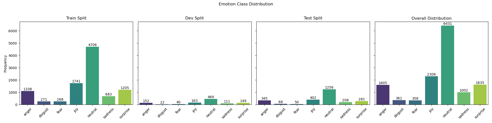
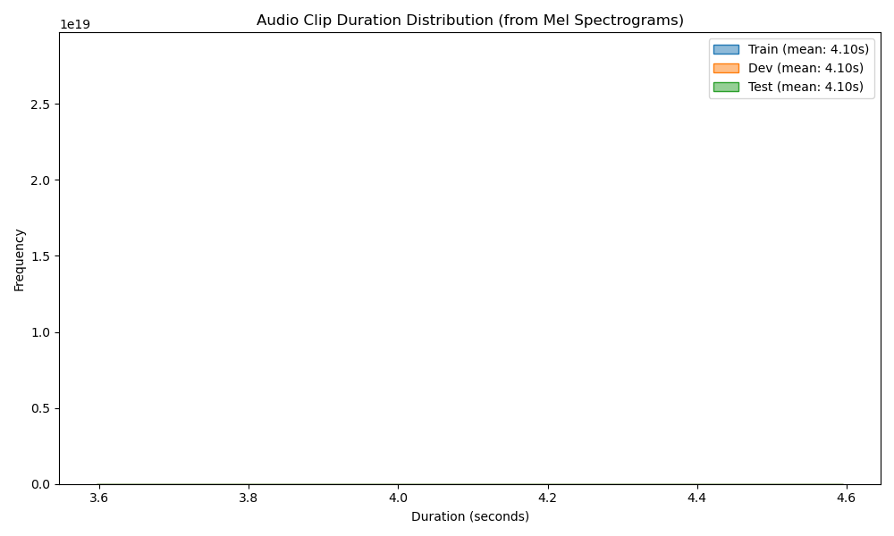
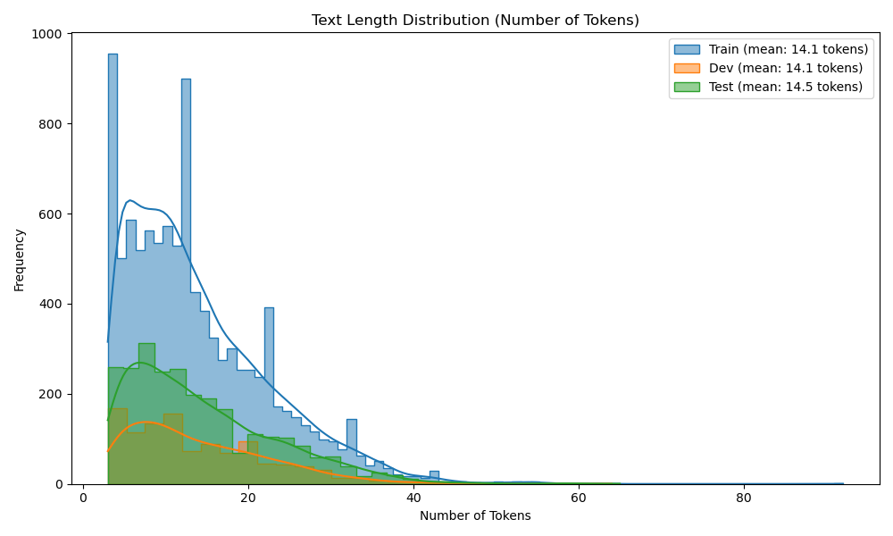
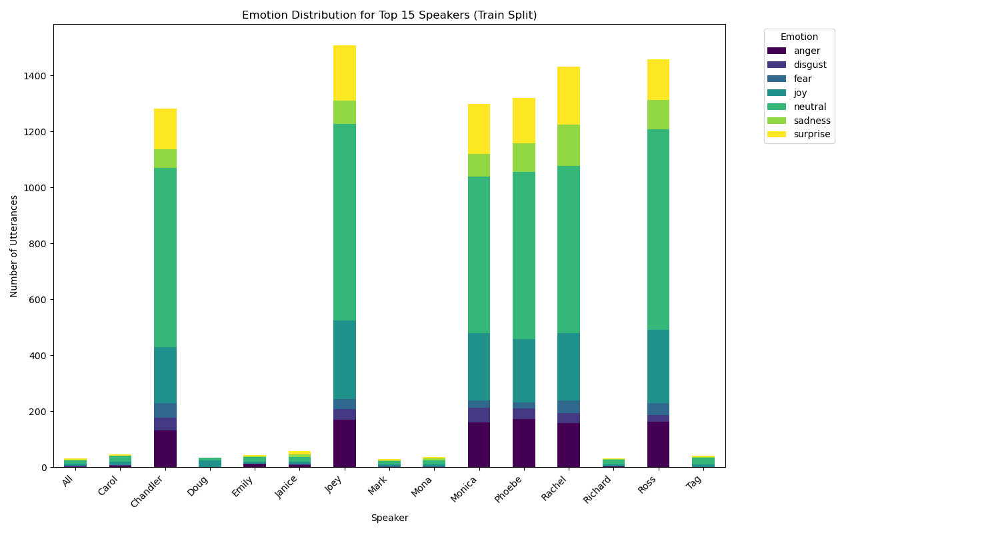

 
 ## MELD Dataset: Pre-processing Data Analysis

The following analysis is based on the raw MELD dataset and provides context for modeling decisions. (Adapted from the original `meld_audiotext_emotion_classifier/README.md`)

### Dataset Size
| Split        | Utterances | Dialogues | Speakers |
|--------------|------------|-----------|----------|
| Training     | 9,989      | 1,038     | 260      |
| Development  | 1,109      | 114       | 47       |
| Test         | 2,610      | 280       | 100      |
| **Total**    | **13,708** | **1,432** | **407*** |
*Total unique speakers likely less due to overlap between splits.

### Emotion Distribution
(Based on typical MELD distributions, verify with `scripts/preliminary_eda.py`)
| Emotion   | Train (%) | Dev (%)  | Test (%)  | Overall Balance |
|-----------|-----------|----------|-----------|-----------------|
| Neutral   | ~47%      | ~42%     | ~48%      | Significant class imbalance |
| Joy       | ~17%      | ~15%     | ~15%      | 2nd most common |
| Surprise  | ~12%      | ~14%     | ~11%      | Moderate        |
| Anger     | ~11%      | ~14%     | ~13%      | Moderate        |
| Sadness   | ~7%       | ~10%     | ~8%       | Less common     |
| Disgust   | ~3%       | ~2%      | ~3%       | Rare            |
| Fear      | ~3%       | ~4%      | ~2%       | Rare            |

### Utterance Statistics
| Split        | Mean Length (chars) | Median Length (chars) | Max Length (chars) |
|--------------|---------------------|-----------------------|--------------------|
| Train        | ~40                 | ~32                   | ~300+              |
| Dev          | ~40                 | ~34                   | ~180+              |
| Test         | ~42                 | ~34                   | ~230+              |

### Dialogue-level Statistics
| Split        | Dialogues | Utterances/Dialog (Mean) | Utterances/Dialog (Max) |
|--------------|-----------|--------------------------|-------------------------|
| Train        | 1,038     | ~9.6                     | ~24                     |
| Dev          | 114       | ~9.7                     | ~23                     |
| Test         | 280       | ~9.3                     | ~33                     |

### Raw Audio File Statistics (Original MELD MP4s)
| Split     | Mean Duration (s) | Max Duration (s) | Original Codec | Original Sample Rate | Original Channels |
|-----------|-------------------|------------------|----------------|----------------|----------------------|
| Train     | ~2.6              | ~8.4             | AAC            | 48kHz          | Mostly 6 (5.1), some 2 |
| Test      | ~3.6              | ~9.5             | AAC            | 48kHz          | Mostly 6 (5.1), some 2 |
*Note: Raw MP4s are converted to mono WAV files at `SAMPLE_RATE` (e.g., 16kHz, configurable in `configs/base_config.py` or YAML) by `scripts/extract_meld_wavs_from_mp4s.py` during the `--prepare_data` step.*

### Key Data Quality Observations & Preprocessing Strategy:
*   **Class Imbalance**: Significant, with "neutral" being dominant. Addressed by using weighted loss functions during training or appropriate sampling strategies.
*   **Video Data**: MELD provides dialogue-level videos, typically packaged in tar.gz archives. The `scripts/download_meld_dataset.py` script is designed to download the main MELD archive and then extract the contained video tarballs (e.g., `train.tar.gz`) into utterance-level MP4 files stored in `meld_data/raw/<split>_videos/`. Subsequently, `scripts/extract_meld_wavs_from_mp4s.py` (called via `main.py --prepare_data`) converts these MP4s to WAVs.
*   **Audio Quality**: Original audio is high quality (e.g., 48kHz from MP4s). Downsampling to a target sample rate (e.g., 16kHz) and conversion to mono are handled during the WAV extraction process by `scripts/extract_meld_wavs_from_mp4s.py`.
*   **Text Quality**: Ground truth transcripts from CSVs are generally clean and used directly for training and standard evaluation.
*   **Utterance Length**: Text utterances are typically short and well-within the token limits of models like DistilRoBERTa. Audio durations are also short, suitable for typical speech feature extractors.
 
 # EDA Report for Processed MELD Dataset
 Generated on: 2025-05-17 11:31:57
 
 ---
 
 ## Overview
 This report provides an exploratory data analysis of the processed MELD Hugging Face datasets.
 Plot images are saved in `results/eda/processed_features_analysis/meld`.
 
 
 ### Dataset Loading Status
 *   Loaded **train** split with **9982** samples.
     *   Columns: `['dialogue_id', 'utterance_id', 'speaker', 'text', 'emotion', 'sentiment', 'audio_path', 'label', 'input_features', 'asr_text', 'input_ids', 'attention_mask']`
 *   Loaded **dev** split with **1106** samples.
     *   Columns: `['dialogue_id', 'utterance_id', 'speaker', 'text', 'emotion', 'sentiment', 'audio_path', 'label', 'input_features', 'asr_text', 'input_ids', 'attention_mask']`
 *   Loaded **test** split with **2610** samples.
     *   Columns: `['dialogue_id', 'utterance_id', 'speaker', 'text', 'emotion', 'sentiment', 'audio_path', 'label', 'input_features', 'asr_text', 'input_ids', 'attention_mask']`
 
 ## 1. Emotion Distribution
 
 
 
 | Split   | Emotion    | Count | Percentage |
 |---------|------------|-------|------------|
 | Train | anger | 1108 | 11.10% |
 | Train | disgust | 271 | 2.71% |
 | Train | fear | 268 | 2.68% |
 | Train | joy | 1741 | 17.44% |
 | Train | neutral | 4706 | 47.14% |
 | Train | sadness | 683 | 6.84% |
 | Train | surprise | 1205 | 12.07% |
 | Dev | anger | 152 | 13.74% |
 | Dev | disgust | 22 | 1.99% |
 | Dev | fear | 40 | 3.62% |
 | Dev | joy | 163 | 14.74% |
 | Dev | neutral | 469 | 42.41% |
 | Dev | sadness | 111 | 10.04% |
 | Dev | surprise | 149 | 13.47% |
 | Test | anger | 345 | 13.22% |
 | Test | disgust | 68 | 2.61% |
 | Test | fear | 50 | 1.92% |
 | Test | joy | 402 | 15.40% |
 | Test | neutral | 1256 | 48.12% |
 | Test | sadness | 208 | 7.97% |
 | Test | surprise | 281 | 10.77% |
 | **Overall** | anger | 1605 | 11.72% |
 | **Overall** | disgust | 361 | 2.64% |
 | **Overall** | fear | 358 | 2.61% |
 | **Overall** | joy | 2306 | 16.83% |
 | **Overall** | neutral | 6431 | 46.95% |
 | **Overall** | sadness | 1002 | 7.31% |
 | **Overall** | surprise | 1635 | 11.94% |
 
 ## 2. Audio Duration (from Mel Spectrograms)
 
 
 
 | Split   | Min (s) | Max (s) | Mean (s) | Median (s) |
 |:--------|--------:|--------:|---------:|-----------:|
 | Train | 4.10 | 4.10 | 4.10 | 4.10 |
 | Dev | 4.10 | 4.10 | 4.10 | 4.10 |
 | Test | 4.10 | 4.10 | 4.10 | 4.10 |
 | **Overall** | 4.10 | 4.10 | 4.10 | 4.10 |
 
 ## 3. Text Length (Number of Tokens)
 
 
 
 | Split   | Min Tokens | Max Tokens | Mean Tokens | Median Tokens |
 |---------|------------|------------|-------------|---------------|
 | Train | 3 | 92 | 14.1 | 12.0 |
 | Dev | 3 | 64 | 14.1 | 12.0 |
 | Test | 3 | 65 | 14.5 | 12.0 |
 | **Overall** | 3 | 92 | 14.2 | 12.0 |
 
 ## 4. Speaker Emotion Patterns (Training Split)
 
 
 ### Top Speaker Emotion Counts (Train Split)
 | Speaker | Total Utterances | Most Frequent Emotion | Count | Less Frequent Emotions (sample) |
 |---------|-----------------:|:----------------------|------:|:--------------------------------|
 | Joey | 1508 | neutral | 704 | joy(279), surprise(198) |
 | Ross | 1457 | neutral | 718 | joy(262), anger(162) |
 | Rachel | 1432 | neutral | 596 | joy(242), surprise(207) |
 | Phoebe | 1321 | neutral | 596 | joy(226), anger(172) |
 | Monica | 1299 | neutral | 560 | joy(239), surprise(178) |
 
 ## 5. Dataset Summary
 | Split   | Number of Samples | Features (Columns) |
 |---------|-------------------|--------------------|
 | Train | 9982 | `dialogue_id, utterance_id, speaker, text, emotion, sentiment, audio_path, label, input_features, asr_text, input_ids, attention_mask` |
 | Dev | 1106 | `dialogue_id, utterance_id, speaker, text, emotion, sentiment, audio_path, label, input_features, asr_text, input_ids, attention_mask` |
 | Test | 2610 | `dialogue_id, utterance_id, speaker, text, emotion, sentiment, audio_path, label, input_features, asr_text, input_ids, attention_mask` |
 
 ## 6. Correlation Analysis (Placeholder)
 Further analysis could explore correlations, e.g., between text length and audio duration.
 
 ---
 Report End.