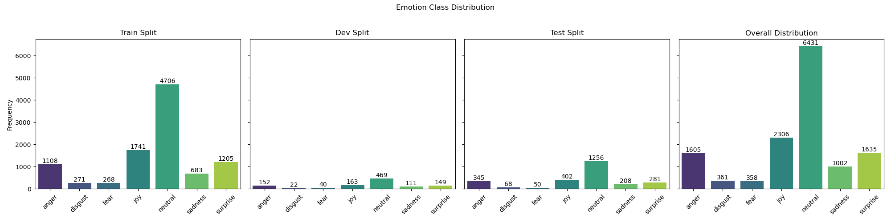
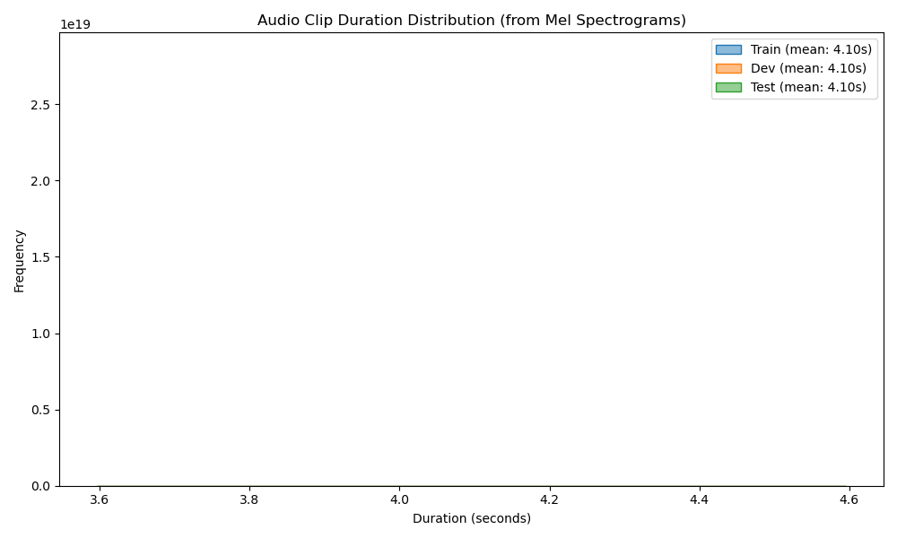
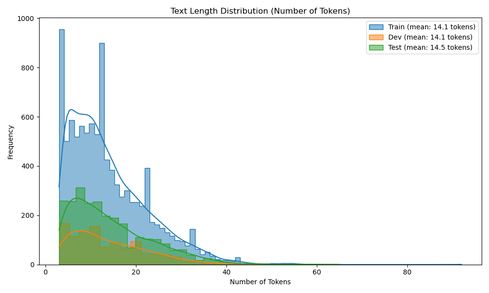
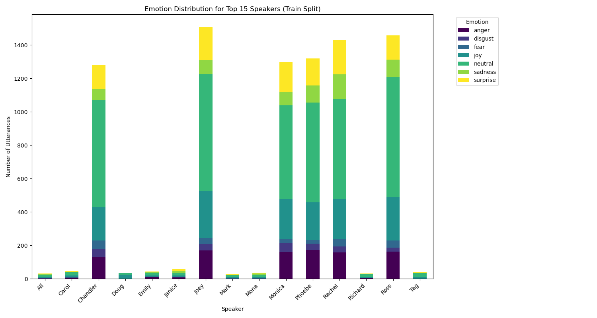

# EDA Report for Processed MELD Dataset
Generated on: 2025-05-17 11:31:57

---

## Overview
This report provides an exploratory data analysis of the processed MELD Hugging Face datasets.
Plot images are saved in `results/eda/processed_features_analysis/meld`.

### Dataset Loading Status
*   Loaded **train** split with **9982** samples.
    *   Columns: `['dialogue_id', 'utterance_id', 'speaker', 'text', 'emotion', 'sentiment', 'audio_path', 'label', 'input_features', 'asr_text', 'input_ids', 'attention_mask']`
*   Loaded **dev** split with **1106** samples.
    *   Columns: `['dialogue_id', 'utterance_id', 'speaker', 'text', 'emotion', 'sentiment', 'audio_path', 'label', 'input_features', 'asr_text', 'input_ids', 'attention_mask']`
*   Loaded **test** split with **2610** samples.
    *   Columns: `['dialogue_id', 'utterance_id', 'speaker', 'text', 'emotion', 'sentiment', 'audio_path', 'label', 'input_features', 'asr_text', 'input_ids', 'attention_mask']`

## 1. Emotion Distribution

| Split   | Emotion    | Count | Percentage |
|---------|------------|-------|------------|
| Train | anger | 1108 | 11.10% |
| Train | disgust | 271 | 2.71% |
| Train | fear | 268 | 2.68% |
| Train | joy | 1741 | 17.44% |
| Train | neutral | 4706 | 47.14% |
| Train | sadness | 683 | 6.84% |
| Train | surprise | 1205 | 12.07% |
| Dev | anger | 152 | 13.74% |
| Dev | disgust | 22 | 1.99% |
| Dev | fear | 40 | 3.62% |
| Dev | joy | 163 | 14.74% |
| Dev | neutral | 469 | 42.41% |
| Dev | sadness | 111 | 10.04% |
| Dev | surprise | 149 | 13.47% |
| Test | anger | 345 | 13.22% |
| Test | disgust | 68 | 2.61% |
| Test | fear | 50 | 1.92% |
| Test | joy | 402 | 15.40% |
| Test | neutral | 1256 | 48.12% |
| Test | sadness | 208 | 7.97% |
| Test | surprise | 281 | 10.77% |
| **Overall** | anger | 1605 | 11.72% |
| **Overall** | disgust | 361 | 2.64% |
| **Overall** | fear | 358 | 2.61% |
| **Overall** | joy | 2306 | 16.83% |
| **Overall** | neutral | 6431 | 46.95% |
| **Overall** | sadness | 1002 | 7.31% |
| **Overall** | surprise | 1635 | 11.94% |

## 2. Audio Duration (from Mel Spectrograms)

| Split   | Min (s) | Max (s) | Mean (s) | Median (s) |
|:--------|--------:|--------:|---------:|-----------:|
| Train | 4.10 | 4.10 | 4.10 | 4.10 |
| Dev | 4.10 | 4.10 | 4.10 | 4.10 |
| Test | 4.10 | 4.10 | 4.10 | 4.10 |
| **Overall** | 4.10 | 4.10 | 4.10 | 4.10 |

## 3. Text Length (Number of Tokens)

| Split   | Min Tokens | Max Tokens | Mean Tokens | Median Tokens |
|---------|------------|------------|-------------|---------------|
| Train | 3 | 92 | 14.1 | 12.0 |
| Dev | 3 | 64 | 14.1 | 12.0 |
| Test | 3 | 65 | 14.5 | 12.0 |
| **Overall** | 3 | 92 | 14.2 | 12.0 |

## 4. Speaker Emotion Patterns (Training Split)

### Top Speaker Emotion Counts (Train Split)
| Speaker | Total Utterances | Most Frequent Emotion | Count | Less Frequent Emotions (sample) |
|---------|-----------------:|:----------------------|------:|:--------------------------------|
| Joey | 1508 | neutral | 704 | joy(279), surprise(198) |
| Ross | 1457 | neutral | 718 | joy(262), anger(162) |
| Rachel | 1432 | neutral | 596 | joy(242), surprise(207) |
| Phoebe | 1321 | neutral | 596 | joy(226), anger(172) |
| Monica | 1299 | neutral | 560 | joy(239), surprise(178) |

## 5. Dataset Summary
| Split   | Number of Samples | Features (Columns) |
|---------|-------------------|--------------------|
| Train | 9982 | `dialogue_id, utterance_id, speaker, text, emotion, sentiment, audio_path, label, input_features, asr_text, input_ids, attention_mask` |
| Dev | 1106 | `dialogue_id, utterance_id, speaker, text, emotion, sentiment, audio_path, label, input_features, asr_text, input_ids, attention_mask` |
| Test | 2610 | `dialogue_id, utterance_id, speaker, text, emotion, sentiment, audio_path, label, input_features, asr_text, input_ids, attention_mask` |

## 6. Correlation Analysis (Placeholder)
Further analysis could explore correlations, e.g., between text length and audio duration.

---
Report End.